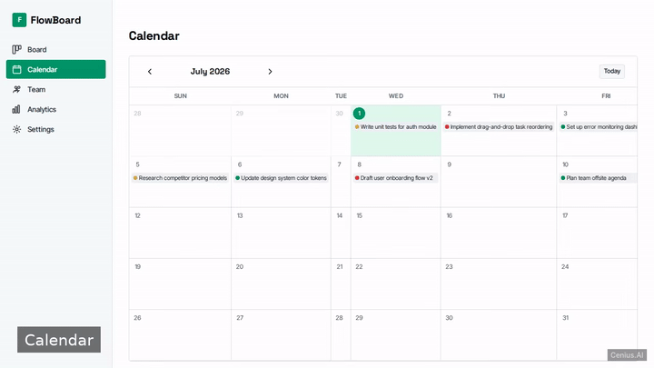
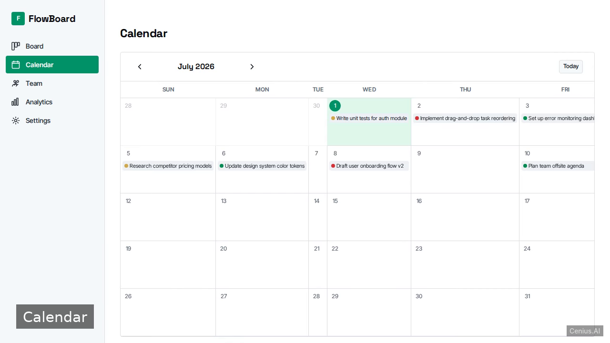
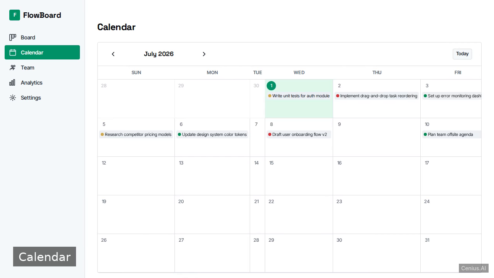

# Multi-Page Kanban Board — complete Vite kanban board example app

Need a self-hosted kanban board? **Multi-Page Kanban Board** is the open-source answer: a Vite project you can clone, run, and own. A client-side React + Vite application featuring a kanban board, calendar view, team management, analytics, and settings. Every Multi-Page Kanban Board line of code is here — no stripped demo, no paywalled features. Apache-2.0-licensed; [remix Multi-Page Kanban Board on cenius.ai](https://cenius.ai/marketplace/p/multi-page-kanban-board?ref=gh&utm_campaign=multi-page-kanban-board-vite) for a bespoke custom version.

  

> **▶ [Open & edit in cenius.ai](https://cenius.ai/marketplace/p/multi-page-kanban-board?ref=gh&utm_campaign=multi-page-kanban-board-vite)** — one click to an editable workspace: describe changes in plain English, get an instant preview, one-click deploy and host. Modifications made on the platform come with full rebrand & relicense rights.

_Local clone? See [Quick start](#quick-start) below. cenius.ai is the zero-setup path._

## Demo

▶ **[Video walkthrough](https://cenius.ai/marketplace/p/multi-page-kanban-board?ref=gh&utm_campaign=multi-page-kanban-board-vite)** — see the app in action on the cenius.ai project page · [MP4 file](.github/media/demo.mp4)

## Screenshots

  

## Features

- Kanban Board
- Calendar View
- Team Management
- Analytics Dashboard
- Settings
- Local Data Persistence
- Seeded Demo Data

## Quick start

See [`INSTALL.md`](INSTALL.md) for full setup and usage instructions.

## Architecture

Open the repo and you'll find a complete Vite application (66 files). Top-level layout: `kanban-board/`, `src/`. See [`INSTALL.md`](INSTALL.md) for complete setup instructions.

## Usage guide

Once the app is running (typically `http://localhost:5173`), you will see the main board. The sidebar allows navigation between pages. All data is saved to your browser's localStorage.

### Routes

| Route | Page | Description |
|---|---|---|
| `/` | Board | Main Kanban board with columns and tasks |
| `/calendar` | Calendar | Monthly calendar with tasks on their due dates |
| `/team` | Team | Manage team members and see their task counts |
| `/analytics` | Analytics | Charts and summary stats |
| `/settings` | Settings | Board appearance and configuration |
| `*` | 404 Not Found | Fallback page for unknown routes |

### Board (`/`)

- **Columns** are shown horizontally. You can drag columns to reorder them.
- **Tasks** are cards inside columns. Drag a task to another column to move it.
- Use the **+** button on a column header to create a new task.
- Click a task card to edit it, or use the delete icon to remove it.
- A **+ Add column** button lets you create a new column.
- Column headers can be edited by clicking the title, and the column can be deleted via the trash icon.

### Calendar (`/calendar`)

- Displays a month grid. Days with tasks show task titles and avatars of assigned members.
- Use the arrows to switch months and the **Today** button to jump to the current month.

### Team (`/team`)

- Lists all team members. Each card shows the member's initials, name, role, and number of assigned tasks.
- Click **Add member** to create a new member (name and role are required).
- Hover over a member card to reveal edit and delete buttons.

### Analytics (`/analytics`)

_Full guide: [`USAGE.md`](USAGE.md)_

## FAQ

### What does it take to self-host Multi-Page Kanban Board?

Grab the repo and run `./install.sh` — it handles packages and seed data in one go. After that, [`INSTALL.md`](INSTALL.md) walks you through starting the server. No external accounts required.

### What if I want to add features to Multi-Page Kanban Board without coding?

The easiest route: [visit the project on cenius.ai](https://cenius.ai/marketplace/p/multi-page-kanban-board?ref=gh&utm_campaign=multi-page-kanban-board-vite), tell the platform what to change, and collect the updated build. No source-editing needed.

### What powers Multi-Page Kanban Board under the hood?

Multi-Page Kanban Board runs on Vite. This repo holds the full production source: you can inspect every part of it before deploying. Highlights include settings.

### Is Multi-Page Kanban Board free for commercial use?

Yes — it ships under the Apache-2.0 license, which permits commercial use, modification and redistribution. The full text is in [LICENSE](LICENSE).

### Can I rebrand or white-label Multi-Page Kanban Board?

White-labeling is supported: fork the MIT-licensed source and rebrand it yourself, or use [cenius.ai](https://cenius.ai/marketplace/p/multi-page-kanban-board?ref=gh&utm_campaign=multi-page-kanban-board-vite) to make changes in a guided workspace — platform modifications come with full rebrand rights.

## License & rebranding

Released under the [Apache License 2.0](LICENSE) (© 2026 Cenius AI) — free for personal and commercial use. The Cenius name/logo are trademarks (see NOTICE).

**Need a customized version?** [Remix this app on cenius.ai](https://cenius.ai/marketplace/p/multi-page-kanban-board?ref=gh&utm_campaign=multi-page-kanban-board-vite) — modifications made on the platform come with **full rebrand & relicense rights** over your derivative.

## Built with cenius.ai

This entire application — code, design, seeded demo data — was generated on **[cenius.ai](https://cenius.ai)** from a plain-English description.

- 🚀 [Build your own app on cenius.ai](https://cenius.ai)
- 🎛️ [Remix Multi-Page Kanban Board on the marketplace](https://cenius.ai/marketplace/p/multi-page-kanban-board?ref=gh&utm_campaign=multi-page-kanban-board-vite) — open it in a workspace, prompt for changes, and ship your own version.

More open-source apps: [the Cenius-ai catalog](https://github.com/Cenius-ai) · [showcase index](https://github.com/Cenius-ai/showcase)
